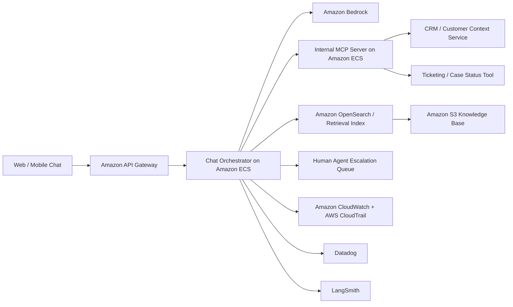

# LumaAssist Chat HLD

## 1. System Overview
- System name: `LumaAssist Chat`
- Business purpose: customer-service copilot and self-service assistant for payments, BNPL, and lending queries
- Decision criticality: `medium`
- System type: customer-facing LLM application
- Executive owner: Head of Customer Operations
- Technical owner: Conversational AI Product Lead

## 2. AI Pattern
- Retrieval-augmented generation using `Amazon Bedrock`
- Conversation orchestration in an application service on `Amazon ECS`
- Internal `MCP` servers used by the assistant to query CRM context, knowledge search, and ticket status tools
- Knowledge documents stored in `Amazon S3`
- Human escalation to contact-center agents for sensitive or low-confidence interactions
- Key substrate properties: `opacity`, `dependency`, `scale asymmetry`

## 3. Core Workflow
1. Customer sends a message through web or mobile chat.
2. Request passes through an application API and session service.
3. Orchestrator retrieves approved knowledge content and customer context.
4. If needed, the assistant calls internal `MCP` tools for CRM lookup, ticket status, or knowledge retrieval.
5. Prompt is assembled and sent to a Bedrock-hosted model.
6. Response is returned to the customer or escalated to a human agent.
7. Prompt, tool, and response traces are stored for review and tuning.

## 4. AWS Architecture

## 5. Data And Integrations
- Input data: customer chat text, account context, case history, approved knowledge articles
- Output data: generated responses, escalation decisions, conversation summaries
- Sensitive data: `PII`, support-case data, account information
- Internal systems: CRM, ticketing, knowledge base, customer portal
- External dependencies: Bedrock model provider, optional SaaS contact-center tooling
- Cross-border flows: prompts and traces may contain PII if masking is weak, which matters for `GDPR` and `UK GDPR`
- Current-state issue: copied customer `PII` in `test` increases the chance that prompt testing and trace review expose live personal data
- MCP exposure: over-broad tool access can expose live customer records or trigger unauthorized ticket and case actions

## 6. Hosting And Operations
- `test`: prompt library testing, jailbreak testing, evaluation datasets, copied unredacted customer `PII`, and test `MCP` tools connected to lower-environment CRM and ticketing data
- `production`: live assistant with approved prompts, retrieval index, escalation rules, and production `MCP` tools
- Identity and access: IAM roles for model invocation, knowledge indexing, and support analytics
- Logging and evidence: CloudWatch app logs, CloudTrail, Datadog service telemetry, LangSmith traces, MCP tool invocation logs
- Monitoring and drift: response quality, escalation rate, hallucination reports, prompt-injection patterns, sensitive-data leakage signals, unusual MCP tool calls

## 7. Lifecycle View
- Design: allowed use cases, banned content, and escalation boundaries must be clearly defined
- Data: knowledge-base provenance, PII minimization, lower-environment masking, and MCP data-return boundaries are central controls
- Develop: prompt templates, guardrails, retrieval logic, and MCP tool schema definitions need versioning and review
- Deploy: prompt or model changes should be promoted through `test` with evaluation evidence
- Monitor: LangSmith and Datadog should support quality reviews, leakage checks, MCP misuse detection, and abuse monitoring

## 8. Enterprise Risk Lenses
- Governance lens: define what the assistant is allowed to say, when it must defer, and who approves prompt changes
- Operational lens: stale knowledge, poor evaluations, or bad retrieval quality can create customer harm and complaint spikes
- Cyber lens: prompt injection, data leakage, exposed endpoints, API-key misuse, MCP tool abuse, and trace exposure of copied `PII` are primary threats

## 9. Standards And Evidence
- Primary standards and regulations: `OWASP LLM Top 10`, `MITRE ATLAS`, `NIST CSF`, `GDPR`, `UK GDPR`, `ISO/IEC 42001`
- Due-diligence artefacts to request: prompt library, evaluation results, leakage tests, LangSmith trace policy, MCP tool inventory, MCP permission matrix, escalation rules, privacy controls, lower-environment data-handling rules, retention settings
- Audit evidence expected: prompt approval records, incident playbooks, access logs, content-filter configurations, model usage logs, MCP invocation logs, evidence of whether `test` traces include live `PII`
