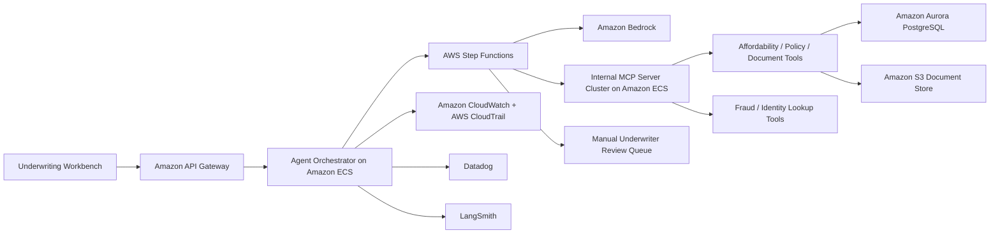

# AutoUnderwriter Agent HLD

## 1. System Overview
- System name: `AutoUnderwriter Agent`
- Business purpose: automate underwriting preparation by gathering data, scoring cases, and proposing underwriting recommendations
- Decision criticality: `high`
- System type: internal agentic workflow supporting credit decisions
- Executive owner: Chief Credit Officer
- Technical owner: AI Workflow Engineering Lead

## 2. AI Pattern
- Agentic workflow using `Amazon Bedrock`, workflow orchestration, and internal tools
- Tool-use actions exposed through internal `MCP` servers for document retrieval, affordability checks, policy lookup, fraud checks, and case summarization
- Human underwriter approval required before final credit decision
- Key substrate properties: `autonomy`, `dependency`, `emergent capability`

## 3. Core Workflow
1. A lending case is submitted into the underwriting queue.
2. The agent retrieves application data, supporting documents, and policy context.
3. It calls internal `MCP` tools to score affordability, summarize risk factors, query supporting systems, and gather missing evidence.
4. A recommendation pack is generated for an underwriter.
5. Human underwriter approves, rejects, or requests more information.
6. Case outcome and trace data are recorded for audit and review.

## 4. AWS Architecture

## 5. Data And Integrations
- Input data: customer application, financial statements, uploaded documents, policy rules, prior risk signals
- Output data: recommended decision, missing-information prompts, summary notes, evidence bundle
- Sensitive data: `PII`, financial data, documents, underwriting rationale
- Internal systems: lending platform, document service, policy repository, case management
- External dependencies: optional identity, fraud, and data-provider APIs
- Cross-border flows: external model or logging services may introduce transfer and retention issues if not constrained
- MCP exposure: over-privileged tool endpoints can expose broad customer and document access to the agent runtime

## 6. Hosting And Operations
- `test`: tool-permission testing, adversarial agent tests, copied unredacted `PII`, and test `MCP` servers connected to lower-environment datasets
- `production`: controlled agent runtime, production `MCP` servers, bounded tool access, manual approval mandatory
- Identity and access: separate IAM roles for orchestrator, tools, and read-only case review
- Logging and evidence: CloudWatch, CloudTrail, Datadog service telemetry, LangSmith traces for prompt and tool execution, MCP tool invocation logs
- Monitoring and drift: tool failure rate, override rate, hallucination or unsupported recommendation rate, prompt-attack attempts, queue latency, unusual MCP call patterns

## 7. Lifecycle View
- Design: tool scope, agent permissions, and manual-approval boundaries must be explicit
- Data: case-document quality, policy-source provenance, lower-environment masking, and MCP-returned data scope matter as much as model quality
- Develop: prompts, tools, MCP schemas, and workflow logic require version control and approval
- Deploy: agent updates should be promoted only after evaluation and approval evidence
- Monitor: trace reviews, override trends, unexpected tool paths, MCP abuse indicators, and drift in case outcomes must be tracked

## 8. Enterprise Risk Lenses
- Governance lens: accountability is hardest here because recommendations emerge from multiple models and tools
- Operational lens: broken tool chains, missing data, or poor queue design can stall underwriting or create unsafe automation
- Cyber lens: prompt injection through uploaded documents, excessive MCP tool permissions, environment-boundary failures, and trace leakage are key threats

## 9. Standards And Evidence
- Primary standards and regulations: `NIST AI RMF`, `ISO/IEC 42001`, `OWASP LLM Top 10`, `MITRE ATLAS`, `GDPR`, `UK GDPR`
- Due-diligence artefacts to request: agent design docs, MCP server inventory, tool permission matrix, manual override policy, evaluation suite, LangSmith access policy, trace retention rules, lower-environment data-handling rules
- Audit evidence expected: approval checkpoints, tool invocation logs, MCP access reviews, case-sampling reviews, incident escalation procedures, evidence of separation between test and production MCP endpoints
