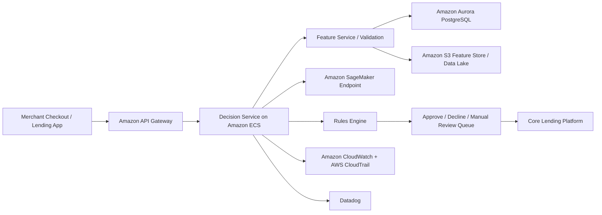

# LumaCredit-EU HLD

## 1. System Overview
- System name: `LumaCredit-EU`
- Business purpose: automated credit-decision support for EU lending and BNPL eligibility
- Decision criticality: `high`
- System type: internal decisioning service exposed through merchant and customer journeys
- Executive owner: Head of Lending
- Technical owner: Credit Platform Engineering Manager

## 2. AI Pattern
- Predictive credit-risk models hosted on `Amazon SageMaker`
- Rules and policy layer executed in an application service on `Amazon ECS`
- Human-in-the-loop design for manual review when model confidence, affordability, or policy thresholds are breached
- Key substrate properties: `opacity`, `drift`, `dependency`

## 3. Core Workflow
1. Merchant checkout or lending workflow calls an internal decision API.
2. API collects application, transaction, device, and bureau data.
3. Data is validated and transformed through a feature pipeline.
4. Model inference runs in `SageMaker` and returns a score.
5. Policy rules determine approve, decline, or manual review.
6. Decision, reason codes, and audit records are written to the core lending platform.

## 4. AWS Architecture

## 5. Data And Integrations
- Input data: customer identity, application details, income, repayment history, device data, bureau or open-banking signals
- Output data: credit score, policy outcome, reason codes, referral flag
- Sensitive data: `PII`, financial data, creditworthiness data
- Internal systems: lending platform, merchant onboarding, CRM, case management
- External dependencies: credit bureau or data provider APIs, open-banking aggregators, payment processors
- Cross-border flows: EU and UK decision data may be stored or backed up in `US-hosted` cloud services, creating `GDPR` concerns
- Current-state issue: unredacted customer `PII` has been copied into `test` for model validation and threshold testing

## 6. Hosting And Operations
- `test`: currently contains unredacted `PII` copied from production-like datasets for model validation, threshold testing, and troubleshooting
- `production`: live model endpoint, Aurora production database, controlled deployment pipeline
- Identity and access: IAM roles for model deployment, app runtime, and analyst read-only review
- Logging and evidence: CloudWatch, CloudTrail, decision logs in Aurora, service metrics in Datadog
- Monitoring and drift: model performance, approval-rate shifts, bad-debt indicators, feature drift, manual review volume

## 7. Lifecycle View
- Design: model purpose, fairness assumptions, approval criteria, and board risk appetite should be documented
- Data: data lineage, label quality, bureau-data contracts, retention, and lower-environment masking need strong control
- Develop: code, feature logic, and model changes need versioning and sign-off
- Deploy: model promotion from `test` to `production` should be gated and logged
- Monitor: drift, error rates, complaint themes, and approval bias indicators should be tracked

## 8. Enterprise Risk Lenses
- Governance lens: high-risk AI classification, model ownership, explainability expectations, and approval accountability
- Operational lens: drift, data quality failure, broken feature pipelines, manual-review overload, or unsafe test-data handling can degrade decisions silently
- Cyber lens: inference endpoint abuse, privileged data access, insecure third-party integrations, and exposed lower-environment `PII` are key concerns

## 9. Standards And Evidence
- Primary standards and regulations: `EU AI Act Annex III`, `ISO/IEC 42001`, `ISO/IEC 5259`, `GDPR`, `UK GDPR`, `PCI DSS`, `NIST AI RMF`
- Due-diligence artefacts to request: model documentation, validation reports, feature lineage, DPIA, lower-environment data-masking policy, approval workflow records, credit-policy rules, audit logs
- Audit evidence expected: deployment approvals, model performance reviews, access logs, retention settings, manual-review procedures, evidence of `test` data sanitization or lack thereof
