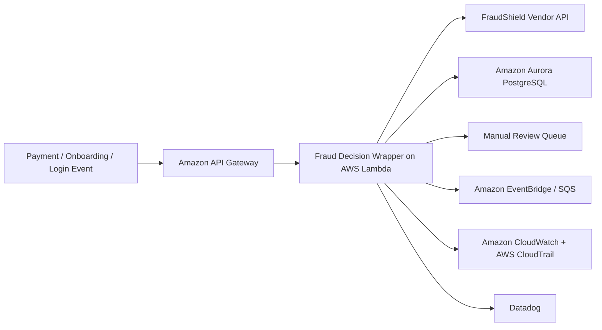

# FraudShield HLD

## 1. System Overview
- System name: `FraudShield`
- Business purpose: detect fraudulent payment, onboarding, or lending behavior using a third-party model service
- Decision criticality: `high`
- System type: third-party AI service integrated into LumaPay workflows
- Executive owner: Head of Fraud
- Technical owner: Platform Integrations Manager

## 2. AI Pattern
- Vendor-hosted fraud-detection model accessed over API
- Local decision wrapper in AWS to apply thresholds and route exceptions
- Human review for flagged or ambiguous cases
- Current-state fallback clarification: the HLD assumes manual or rules-based fail-safe fallback decisions; a deployed internal SageMaker fallback model is not evidenced and should not be claimed until tested
- Key substrate properties: `dependency`, `opacity`, `scale asymmetry`

## 3. Core Workflow
1. A transaction, login, or onboarding event occurs.
2. LumaPay sends selected event features to the FraudShield API.
3. Vendor returns a fraud score and reason indicators.
4. Local rules determine block, allow, or manual review.
5. Decision and vendor response are stored for audit and tuning.

## 4. AWS Architecture

## 5. Data And Integrations
- Input data: transaction metadata, customer identity signals, device fingerprint, merchant context, behavioural indicators
- Output data: vendor fraud score, local decision, case escalation flag
- Sensitive data: `PII`, transaction data, potentially payment-adjacent data
- Internal systems: payments platform, onboarding, identity, fraud operations dashboard
- External dependencies: FraudShield vendor API and its upstream data/model supply chain
- Cross-border flows: vendor hosting and support locations must be understood for `GDPR`, `UK GDPR`, and supplier-risk analysis
- Adjacent agent risk: downstream agents or MCP-connected workflows may consume FraudShield results, so integrity and provenance of vendor output matter beyond the API boundary

## 6. Hosting And Operations
- `test`: mocked vendor responses, threshold tuning, synthetic fraud scenarios
- `production`: live fraud API integration, rate limits, manual or rules-based fail-safe fallback decisions; internal model fallback requires separate evidence if claimed
- Identity and access: API credentials in Secrets Manager, Lambda execution roles, read-only fraud analyst access
- Logging and evidence: CloudWatch, CloudTrail, Datadog telemetry, vendor SLA and incident records
- Monitoring and drift: API latency, vendor outage rate, false-positive shifts, fraud-loss trends, manual review volume
- Resilience monitoring: circuit-breaker activation, fallback queue volume, vendor SLA breaches, assignment-rights status, and concentration-risk exposure should be tracked

## 7. Lifecycle View
- Design: third-party dependency and exit strategy should be explicit
- Data: only the minimum necessary event data should be sent to the vendor
- Develop: wrapper logic, thresholds, and fallback rules require versioning
- Deploy: key rotation, API changes, and release coordination are critical
- Monitor: vendor outages, score drift, and contractual changes must be tracked continuously
- Fallback validation: manual review and rules-based fallback should be tested; any claim of model fallback must include deployment, failover, and performance evidence

## 8. Enterprise Risk Lenses
- Governance lens: ownership of vendor risk, model explainability expectations, and contract accountability must be clear
- Operational lens: vendor outage or licence disruption can immediately impair fraud controls
- Cyber lens: third-party API compromise, insecure credentials, and supply-chain attack paths dominate the risk picture

## 9. Standards And Evidence
- Primary standards and regulations: `ISO/IEC 27036`, `DORA`, `NIST CSF`, `GDPR`, `UK GDPR`, `PCI DSS`
- Due-diligence artefacts to request: vendor contract, change-of-control clauses, SLA, security addendum, data-processing agreement, incident history, audit reports, fallback runbook, concentration-risk assessment
- Audit evidence expected: API credential controls, fallback design, failover or manual-review test evidence, vendor review records, outage runbooks, evidence of contractual rights
